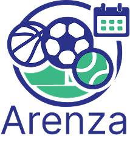

# Project Title : Flutter Base

# Project BackEnd : ASP or PHP

## Project Description : Flutter Base Description

**The main idea**

**Types of users**

1. USERS

**FLUTTER_VERSION** : 3.38.9

## Links for development :

1. [postman collection](ADD_LINK_HERE)

2. [UI](UI_LINK)

3. [Test_file](TEST_FILE_LINK)

## Dashboard :

1. [Link](DASHBOARD_LINK)
2. dashboard account :
   - email : EMAIL
   - password : PASS

## Accounts for App :

[USER]===>

## Links for project :

1. [App in app store]()
2. [App in google play]()

## App Bundle :

-com.aait.arenza
or

- com.cs.flutter_base

## FireBase :

1. FIREBASE_ACCOUNT_HOLDER
   - AAIT
     or
   - CS
2. PROJECT_NAME_IN_FIREBASE
   - Flutter_Base

## Team members :

1. **Flutter**

   - DEVELOPER_NAME

2. **Backend**

   - DEVELOPER_NAME

3. **Testing**

   - DEVELOPER_NAME

## Image :



## Localization Generator:

### Run this Command to generate localization files

```bash
dart run generate/strings/main.dart
```

## Assets Generator:

### Run this command to activate assets generator

```bash
dart pub global activate flutter_gen
```

### Run this Command to generate app icons

```bash
dart run build_runner build
```
